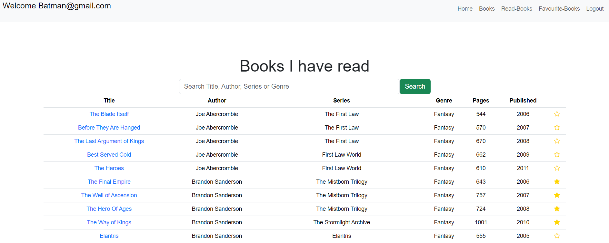
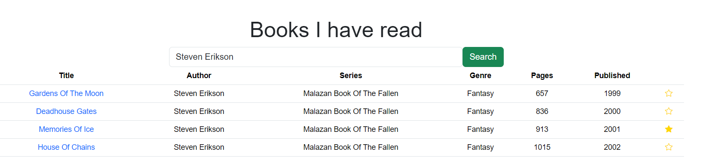
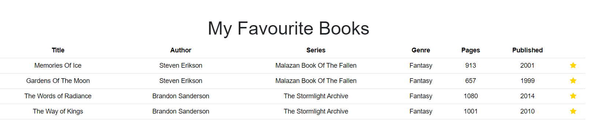

# About the project
Platform/Runtime Environment: Node.js
Framework: Express
Programming language: Javascript
Database: MySql
ORM: Sequelize

# My Personal book library
Personal project to keep a detailed overview of the books i have read
Project is still open for further development

# Application in action: Each user have there own list of read books and favourite books
All books the user have read

Search functionality

List of favourite books. Clicking star button will add or remove
